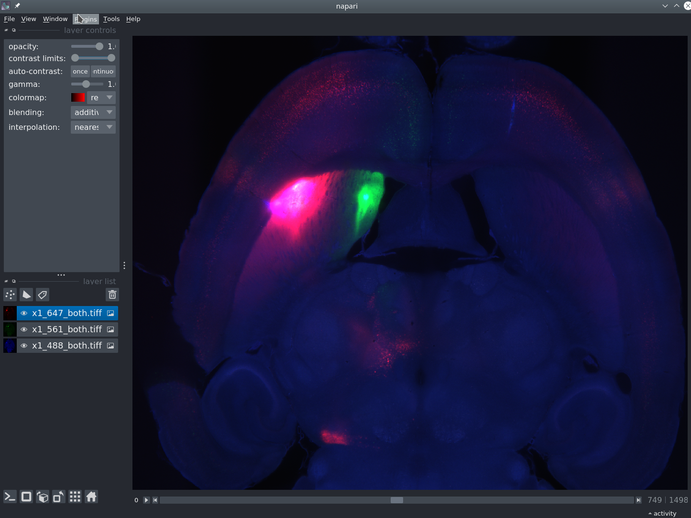

# mesoSPIM-lazy-loader

Lazy-loader for mesoSPIM acquisitions using napari.
This plugin lazy-loads all acquired channels from a mesoSPIM acquisition.
Once installed, you can open a folder containing a mesoSPIM acquisition and the plugin will lazy load it.
All channels are loaded and automatically color-coded nicely.

### Known issues
* Works only with TIFF stacks that have associated meta-data files
* Will load both shutters and overlay. (TODO: add a widget to allow switching between shutters using a button)
* Since it lazy-loads each plane as required using dask, it will cause napari to freeze if the user requests a 3D view or a reslice view. Some solution is needed for this. e.g. disable the buttons.

----------------------------------

This [napari] plugin was generated with [Cookiecutter] using [@napari]'s [cookiecutter-napari-plugin] template.

<!--
Don't miss the full getting started guide to set up your new package:
https://github.com/napari/cookiecutter-napari-plugin#getting-started

and review the napari docs for plugin developers:
https://napari.org/stable/plugins/index.html
-->

## Installation
Not on PyPi yet.
Either clone, `cd` and `pip install .` or `pip install git+<GITURL>`

## Contributing

Contributions are very welcome.
You can set up tests with [tox] (none yet), please ensure the coverage at least stays the same before you submit a pull request.

## License

Distributed under the terms of the [GNU GPL v3.0] license,
"mesoSPIM-lazy-loader" is free and open source software

## Issues

If you encounter any problems, please [file an issue] along with a detailed description.

[napari]: https://github.com/napari/napari
[Cookiecutter]: https://github.com/audreyr/cookiecutter
[@napari]: https://github.com/napari
[MIT]: http://opensource.org/licenses/MIT
[BSD-3]: http://opensource.org/licenses/BSD-3-Clause
[GNU GPL v3.0]: http://www.gnu.org/licenses/gpl-3.0.txt
[GNU LGPL v3.0]: http://www.gnu.org/licenses/lgpl-3.0.txt
[Apache Software License 2.0]: http://www.apache.org/licenses/LICENSE-2.0
[Mozilla Public License 2.0]: https://www.mozilla.org/media/MPL/2.0/index.txt
[cookiecutter-napari-plugin]: https://github.com/napari/cookiecutter-napari-plugin

[napari]: https://github.com/napari/napari
[tox]: https://tox.readthedocs.io/en/latest/
[pip]: https://pypi.org/project/pip/
[PyPI]: https://pypi.org/
